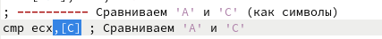

---
## Front matter
title: "Отчёт по лабораторной работе №7"
subtitle: "Дисциплина: Архитектура компьютера"
author: "Даровских Александра Сергеевна"

## Generic otions
lang: ru-RU
toc-title: "Содержание"

## Bibliography
bibliography: bib/cite.bib
csl: pandoc/csl/gost-r-7-0-5-2008-numeric.csl

## Pdf output format
toc: true # Table of contents
toc-depth: 2
lof: true # List of figures
lot: true # List of tables
fontsize: 12pt
linestretch: 1.5
papersize: a4
documentclass: scrreprt
## I18n polyglossia
polyglossia-lang:
  name: russian
  options:
	- spelling=modern
	- babelshorthands=true
polyglossia-otherlangs:
  name: english
## I18n babel
babel-lang: russian
babel-otherlangs: english
## Fonts
mainfont: PT Serif
romanfont: PT Serif
sansfont: PT Sans
monofont: PT Mono
mainfontoptions: Ligatures=TeX
romanfontoptions: Ligatures=TeX
sansfontoptions: Ligatures=TeX,Scale=MatchLowercase
monofontoptions: Scale=MatchLowercase,Scale=0.9
## Biblatex
biblatex: true
biblio-style: "gost-numeric"
biblatexoptions:
  - parentracker=true
  - backend=biber
  - hyperref=auto
  - language=auto
  - autolang=other*
  - citestyle=gost-numeric
## Pandoc-crossref LaTeX customization
figureTitle: "Рис."
tableTitle: "Таблица"
listingTitle: "Листинг"
lofTitle: "Список иллюстраций"
lotTitle: "Список таблиц"
lolTitle: "Листинги"
## Misc options
indent: true
header-includes:
  - \usepackage{indentfirst}
  - \usepackage{float} # keep figures where there are in the text
  - \floatplacement{figure}{H} # keep figures where there are in the text
---

# Цель работы

Изучение команд условного и безусловного переходов. Приобретение навыков написания программ с использованием переходов. Знакомство с назначением и структурой файла листинга.

# Задание

1. Реализация переходов в NASM.
2. Изучение структуры файлы листинга.
3. Задания для самостоятельной работы.

# Теоретическое введение

Для реализации ветвлений в ассемблере используются так называемые команды передачи управления или команды перехода. Можно выделить 2 типа переходов:

• условный переход – выполнение или не выполнение перехода в определенную точку программы в зависимости от проверки условия.

• безусловный переход – выполнение передачи управления в определенную точку программы без каких-либо условий.

Безусловный переход выполняется инструкцией jmp. Инструкция cmp является одной из инструкций, которая позволяет сравнить операнды и выставляет флаги в зависимости от результата сравнения. Инструкция cmp является командой сравнения двух операндов и имеет такой же формат, как и команда вычитания.

Листинг (в рамках понятийного аппарата NASM) — это один из выходных файлов, создаваемых транслятором. Он имеет текстовый вид и нужен при отладке программы, так как кроме строк самой программы он содержит дополнительную информацию.

# Выполнение лабораторной работы

## 4.1	Реализация переходов в NASM

С помощью команды mkdir создаем директорию, в которой будем создавать файлы с программами для лабораторной работы №7 (рис.@fig:001). Переходим в созданный каталог с помощью команды cd

{#fig:001 width=70%}

С помощью команды touch создаем файл lab7-1.asm (рис.@fig:002).

{#fig:002 width=70%}

Открываем созданный файл lab7-1.asm, вставляем программу из листинга 7.1 (рис.@fig:003).

{#fig:003 width=70%}

Создаем исполняемый файл и запускаем его. (рис.@fig:004).

{#fig:004 width=70%}

jmp \_label2 меняет порядок исполнения инструкций и позволяет выполнить инструкции начиная с метки \_label2, пропустив вывод первого сообщения.

Изменяем программу, чтобы она выводила сначала ‘Сообщение № 2’, потом ‘Сообщение № 1’ и завершала работу в соответствии с листингом 7.2. (рис.@fig:005).

{#fig:005 width=70%}

Создаем новый исполняемый файл программы и запускаем его. (рис. @fig:006).

{#fig:006 width=70%}

Затем изменяем текст программы, добавив в начале программы jmp \_label3, jmp \_label2 в конце метки jmp \_label3, jmp \_label1 добавляем в конце метки jmp \_label2, и добавляем jmp \_end в конце метки jmp \_label1, (рис. @fig:007).

{#fig:007 width=70%}

Создаем новый исполняемый файл программы и запускаем его: (рис. @fig:008).

{#fig:008 width=70%}

Рассмотрим программу, которая определяет и выводит на экран наибольшую из 3 целочисленных переменных: A,B и C. Значения для A и C задаются в программе, значение B вводиться с клавиатуры.

Создаю файл lab7-2.asm в каталоге ~/work/study/2023-2024/Архитектура\ компьютера/arch-pc/lab07. (рис. @fig:009).

{#fig:009 width=70%}

Текст программы из листинга 7.3 вводим в lab7-2.asm. (рис. @fig:010).

{#fig:010 width=70%}

Создаем новый исполняемый файл программы и запускаем его. (рис. @fig:011).

{#fig:011 width=70%}

Файл работает корректно.

## 4.2	Изучение структуры файлы листинга

Создаем файл листинга для программы из файла lab7-2.asm. (рис. @fig:012).

{#fig:012 width=70%}

Открываем файл листинга lab7-2.lst с помощью текстового редактора и изучаем содержимое. (рис. @fig:0013).

{#fig:013 width=70%}

В представленных трех строчках содержаться следующие данные: (рис. @fig:014).

{#fig:014 width=70%}

“2” - номер строки кода, “; Функция вычисления длинны сообщения” - комментарий к коду, не имеет адреса и машинного кода.

“3” - номер строки кода, “slen” - название функции, не имеет адреса и машинного кода.

“4” - номер строки кода, “00000000” - адрес строки, “53” - машинный код, “push ebx” - исходный текст программы, инструкция “push” помещает операнд “ebx” в стек.

Открываем файл с программой lab7-2.asm и удаляем выделенный операнд. (рис. @fig:015).

{#fig:015 width=70%}

Выполняем трансляцию с получением файла листинга. (рис. @fig:016).

{#fig:016 width=70%}

Инструкция mov (единственная в коде, содержащая два операнда) не может работать только с одним операндом, что нарушает код.

## 4.3	Задания для самостоятельной работы

1. Мой вариант под номером 18, a,b,c - 83, 73 и 30. (рис. @fig:017).

{#fig:017 width=70%}

Создаю исполняемый файл и проверяю его работу, подставляя необходимые значение. (рис. @fig:018).

{#fig:018 width=70%}

Программа работает корректно.

Код программы:

include 'in\_out.asm'

section .data

msg db "Наименьшее число: ",0h

A dd '83'

B dd '73'

C dd '30'

section .bss

min resb 10

section .text

global \_start

\_start:

; ---------- Записываем 'B' в переменную 'min'

mov ecx,[B] ; 'ecx = B'

mov [min],ecx ; 'min = B'

; ---------- Сравниваем 'B' и 'С' (как символы)

cmp ecx,[B] ; Сравниваем 'B' и 'С'

jg check\_B ; если 'B<C', то переход на метку 'check\_A',

mov ecx,[C] ; иначе 'ecx = C'

mov [min],ecx ; 'min = C'

; ---------- Преобразование 'min(B,C)' из символа в число

check\_B:

mov eax,min

call atoi ; Вызов подпрограммы перевода символа в число

mov [min],eax ; запись преобразованного числа в min

; ---------- Сравниваем 'min(B,C)' и 'A' (как числа)

mov ecx,[min]

cmp ecx,[A] ; Сравниваем 'min(B,C)' и 'A'

jl fin ; если 'min(B,C)<A', то переход на 'fin',

mov ecx,[A] ; иначе 'ecx = A'

mov [min],ecx

; ---------- Вывод результата

fin:

mov eax, msg

call sprint ; Вывод сообщения 'Наименьшее число: '

mov eax,[min]

call iprintLF ; Вывод 'min(A,B,C)'

call quit ; Выход

Код программы

1. a^2, a=1;   10+x, a=1 (рис. @fig:019).

{#fig:019 width=70%}

Создаю исполняемый файл и проверяю его работу для значений х и а соответственно: (1;2), (2;1). (рис. @fig:019).

{#fig:020 width=70%}

Программа работает корректно.

Код программы:

%include 'in\_out.asm'

section .data

`    `prompt\_x db "Введите значение x: ", 0

`    `prompt\_a db "Введите значение a: ", 0

`    `result\_msg db "Результат: ", 0

`    `new\_line db 10, 0

section .bss

`    `x resd 1     ; переменная для хранения введенного значения x

`    `a resd 1     ; переменная для хранения введенного значения a

`    `result resd 1  ; переменная для хранения результата

section .text

global \_start

\_start:

`    `; запрос значения x

`    `mov edx, prompt\_x

`    `call sprint

`    `call sread

`    `mov [x], eax  ; сохраняем x

`    `; запрос значения a

`    `mov edx, prompt\_a

`    `call sprint

`    `call sread

`    `mov [a], eax  ; сохраняем a

`    `; вычисление и вывод результата

`    `mov eax, [a]

`    `cmp eax, 1

`    `je a\_is\_1     ; если a=1, переходим к вычислению 10 + x

`    `imul eax, eax  ; умножаем a на само себя

`    `jmp print\_result

a\_is\_1:

`    `add eax, [x]  ; вычисляем 10 + x

print\_result:

`    `mov [result], eax  ; сохраняем результат

`    `mov edx, result\_msg

`    `call sprint

`    `mov eax, [result]

`    `call iprintLF

`    `; выход

`    `call quit

# 5 Выводы

При выполнении данной лабораторной работы я команды условного и безусловного переходов, приобрела навыки написания программ с использованием переходов и ознакомилась с назначением и структурой файла листинга, что поможет мне при выполнении последующих лабораторных работ.

# 6 Список литературы

1. [Лабораторная работа №7. Команды безусловного и условного переходов в Nasm. Программирование ветвлений.](https://esystem.rudn.ru/pluginfile.php/2089087/mod_resource/content/0/Лабораторная%20работа%20№7.%20Команды%20безусловного%20и%20условного%20переходов%20в%20Nasm.%20Программирование%20ветвлений..pdf)

